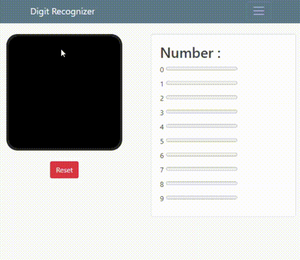
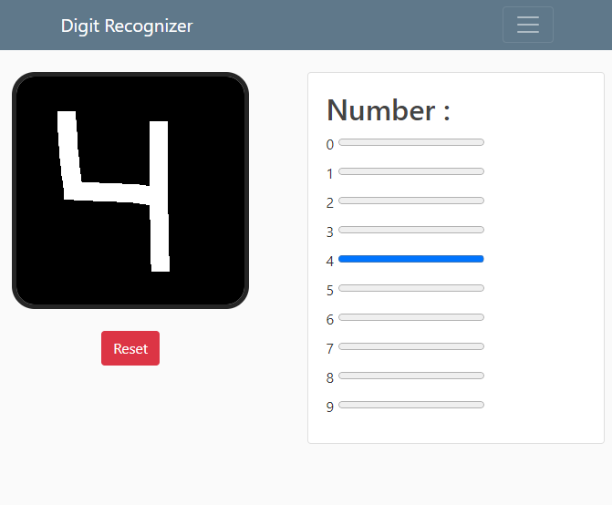

# Digit Recognizer

---

### Table of Contents

- [Description](#description)
- [How To Use](#how-to-use)
- [References](#references)
- [License](#license)
- [Author Info](#author-info)

---

## Description

A convolutional neural network model trained to recognize digits and deployed using python flask.

#### Technologies:

- Keras 
- Flask

[Back To The Top](#digit-recognizer)

---

## How To Use

1. Clone this repo
2. Create a new python env
3. Install requirements
4. Run run.py

